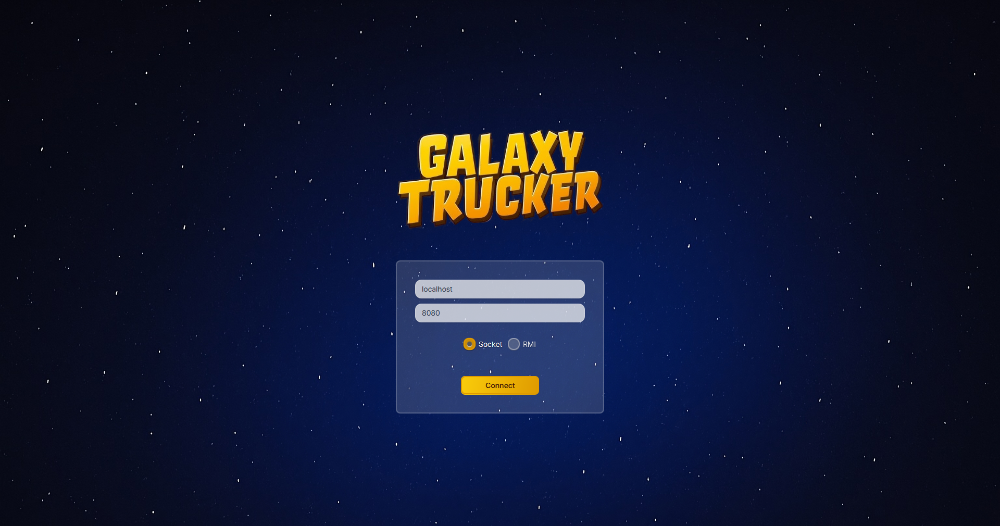
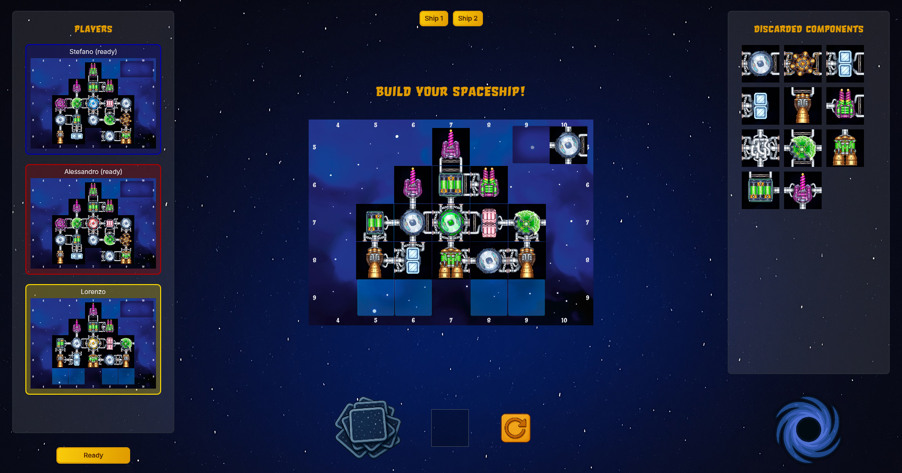
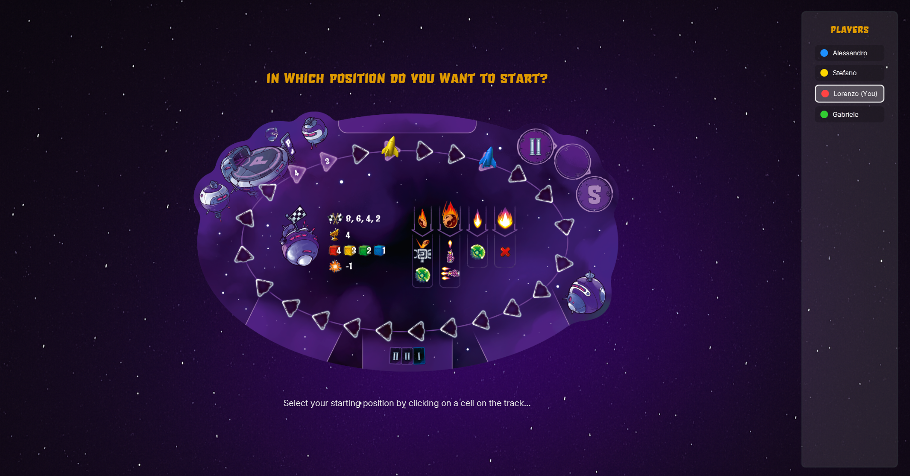
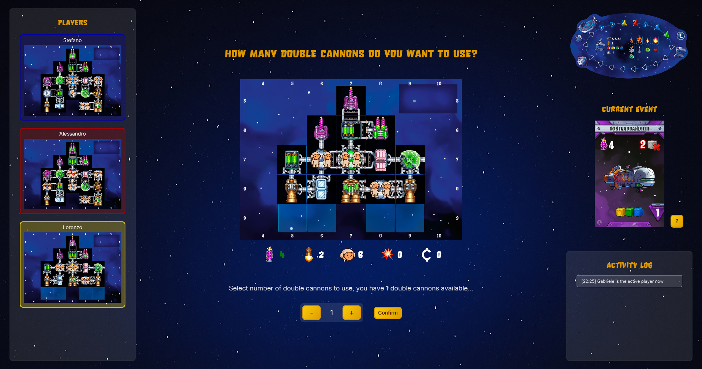
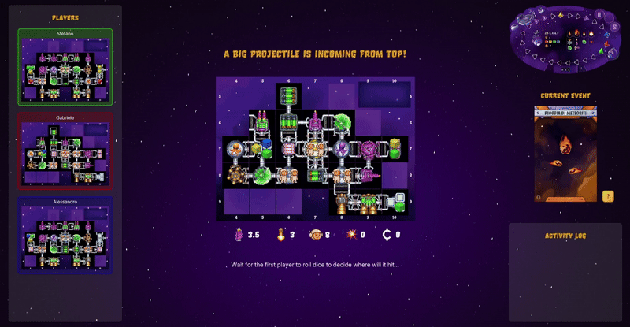

# Galaxy Trucker


**Galaxy Trucker** is the final test of **Software Engineering**, course of Computer Science and Engineering held at Polytechnic University of Milan (2024/2025).

**Teacher**: San Pietro Pierluigi

The final vote is: **?/30**.


## The Team
* [Alessandro Pasquetto](https://github.com/Alessandro-Pasquetto) (Matricola...)
* [Gabriele Pedesini](https://github.com/gabrielepedesini) (Matricola...)
* [Stefano Molteni](https://github.com/stefano656) (Matricola...)
* [Lorenzo Orlandi](https://github.com/CreepyToucan) (Matricola...)


## Project specification
The project is a Java game, Cranio Creation's Galaxy Trucker.

The final version includes:
* Model UML diagram;
* Working game implementation, which has to be rules compliant;
* Source code of the implementation;
* Source code of unity tests.


## Implemented Functionalities
| Functionality     | Status |
|------------------|--|
| Basic rules      | ✅ |
| Complete rules   | ✅ |
| Socket          | ✅ |
| RMI            | ✅ |
| TUI            | ✅ |
| GUI            | ✅️ |
| Demo travel    | ✅ |
| Multiple games | ✅ |
| Resilience     | ✅ |
| Persistence    | ⛔ |

#### Legend
[⛔]() Not Implemented &nbsp;&nbsp;&nbsp;&nbsp;[⚠️]() Implementing&nbsp;&nbsp;&nbsp;&nbsp;[✅]() Implemented

<!--
[](#)
[](#)
[](#)
-->


## Test cases
The tests were made for the Model and Controller package.

| Package    | Methods (%)   | Lines (%)       | Branch (%)      |
|:-----------|:--------------|:---------------:|:---------------:|
| Model      | 99% (314/316) | 95% (1560/1634) | 78% (1081/1382) |
| Controller | 65% (169/257) | 56% (1577/2815) | 42% (667/1582)  |


## Compile and Run

To run the tests and compile the software:

1. Install [Java SE 23](https://www.oracle.com/java/technologies/javase/jdk23-archive-downloads.html);
2. Clone this repository
3. Open a Command Prompt or Bash terminal
   > ⚠️ *We do **not** recommend using Windows PowerShell due to encoding issues.*
4. Navigate to the `deliverables/final/jar` directory.  
   In this folder, you will find the JAR files which already include all project dependencies.
5. Execute the following commands:

```bash
// (For Windows users, use this command to change character encoding)
CHCP 65001

// Start the Server
java -jar server.jar

// Start how many Clients you want
java -jar client.jar
```


## Game Screenshot








## Software used
**Signavio** - Initial UML

**sequencediagram.org** - Sequence diagrams

**Intellij IDEA Ultimate** - Main IDE


## Copyright
Galaxy Trucker Board Game is copyrighted.